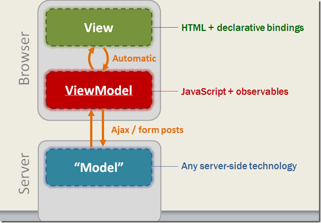

# 1 Introduction to the [Knockout.js] MVVM library

Following the wake of [Node.js] and the foundation of a giant and rapidly growing Javascript ecosystem, multiple implementations of the [Model View Controller (MVC)] architectural pattern have emerged. The by far simplest one of these is [Knockout.js], which makes use of a variation of MVC called [Model View Viewmodel (MVVM)]. Please *make yourself familiar with the key concepts behind MVVW* since it will greatly help you to understand how Knockout works.

In contrast to many of the other available MVC/MVVM implementations, Knockout.js is a library that takes care of the **data-binding** between the model and the view. By doing this, it frees developers from the hassle of manually updating the DOM when data in the JS model changes, respectively vice versa, updating the JS model when the user modifies the data in the course of interaction with the web application.

It also offers binding of viewmodel functionality to events, and last but not least, [templating]. v3.2.0 introduced [Knockout components]


Knockout was developed and is maintained as an open source project by Steve Sanderson, a Microsoft employee. Despite this fact Knockout never was and never will be a Microsoft product, and is release under the [MIT License].

As of November 2015, the most recent stable version of Knockout.js is [Knockout.js v3.3.0]. There currently is a [release candidate of v3.4.0] available that, besides new functionality and a number of fixes, is claimed to make core features 2-3 times faster than in v.3.3.0.

>- Performance Improvement - for named templates that use a template or normal element use the element directly as the template to clone
>- Performance Improvement - Make observables 2-3x faster to instantiate and reduce memory usage by 50%
>- Performance Improvement - Make computeds 2x faster to instantiate and reduce memory usage by 50%

## 1.1 Brief summary of the differences between MVC and MVVW

For the sake of completeness, despite this not being the topic of this book, here's an excerpt from a blog post by [Eric Hoff] that briefly describes the differences between MVC and MVVW.

>The most obvious answer, and the most over-simplified answer is that MVC is primarily a server-side programming pattern, while MVVM is more often a client-side pattern.

>MVVM is concerned with keeping the View up-to-date with the server data in the Model and ViewModel. The ViewModel is a special object separate from the Model (though not always). In a web app using MVVM the Model usually represents the data on a server, while the ViewModel is the data on the client. MVVM often also uses the Observer pattern to keep the View in sync with the ViewModel data that backs it up, and the same for the ViewModel and Model. When a change in the Model or ViewModel data is observed the View will refresh itself to show the latest Model data. Likewise, when a form is used in the View to update the Model these changes can be passed back to the Model on the server immediately.

><http://willcodeforcoffee.com/2013/06/12/what-is-mvc-vs-mvvm-pattern/>



##1.2 First example

The first example shows the basic concept that ties a viewmodel to a view. Find the snippets in Codepen.io here: <http://codepen.io/connexo/pen/wKYpLP>

### View (HTML with declarative bindings)

```html
<!DOCTYPE html>
<html>
	<head>
		<script src="path/to/knockout.js"></script>
	</head>
	<body>
		<h1>Introduction to Knockout.js</h1>
		<p>My first name is <span data-bind="text: firstName"></span>.</p>
		<p>My last name is <span data-bind="text: lastName"></span>.</p>
		<hr />
		<p>My full name is <span data-bind="text: fullName()"></span>.</p>
	</body>
</html>
```

### Viewmodel containing the data
```javascript
var ExampleViewModel = function() {
	var self = this; // Store a stable reference to this
	
	/* BEGIN Properties */ 
	self.firstName = "Peter";
	self.lastName = "Miller";
	self.fullName = function() {
		return self.firstName + " " + self.lastName;
	};
	/* END Properties */ 
};

ko.applyBindings(new ExampleViewModel()); // This is where all the magic happens
```

##1.3 Observable and computed values

The second example shows observable and computed properties for a dynamic view. Find the snippets in Codepen.io here: <http://codepen.io/DirtyHerby/pen/epPbRr>

### View

```html
<p>My first name is <input data-bind="value: firstName"></span>.</p>
<p>My last name is <input data-bind="value: lastName"></span>.</p>
<hr />
<p>My first name is <span data-bind="text: firstName"></span>.</p>
<p>My last name is <span data-bind="text: lastName"></span>.</p>
<hr />
<p>My full name is <span data-bind="text: fullName()"></span>.</p>
```

### Viewmodel
```javascript
self.firstName = ko.observable("Peter");
self.lastName = ko.observable("Miller");
self.fullName = ko.computed(function() {
	return self.firstName() + " " + self.lastName();
});
```

##1.4 Lists and Collections

The third example shows lists and collections for generate repeating blocks of UI elements by using observable arrays and the foreach binding. Find the snippets in Codepen.io here: <http://codepen.io/DirtyHerby/pen/gaBqMx>

### View

```html
<h2>Your seat reservations (<span data-bind="text: seats().length"></span>)</h2>

<table>
	<thead>
		<tr>
			<th>Passenger name</th>
			<th>Meal</th>
			<th>Surcharge</th>
			<th></th>
		</tr>
	</thead>
	<tbody data-bind="foreach: seats">
		<tr>
			<td>
				<input data-bind="value: name" />
			</td>
			<td>
				<select data-bind="options: $root.availableMeals, value: meal, optionsText: 'mealName'"></select>
			</td>
			<td data-bind="text: formattedPrice"></td>
			<td><a href="#" data-bind="click: $root.removeSeat">Remove</a></td>
		</tr>
	</tbody>
</table>

<button data-bind="click: addSeat, enable: seats().length < 5">Reserve another seat</button>

<h3 data-bind="visible: totalSurcharge() > 0">
	Total surcharge: <span data-bind="text: totalSurcharge().toFixed(2)"></span>€
</h3>
```

### Viewmodel
```javascript
// Class to represent a row in the seat reservations grid
function SeatReservation(name, initialMeal) {
  var self = this;
  self.name = name;
  self.meal = ko.observable(initialMeal);

  self.formattedPrice = ko.computed(function() {
    var price = self.meal().price;
    return price ? price.toFixed(2) + "€" : "None";
  });
}

// Overall viewmodel for this screen, along with initial state
function ReservationsViewModel() {
  var self = this;

  // Non-editable catalog data - would come from the server
  self.availableMeals = [{
    mealName: "Standard (sandwich)",
    price: 0
  }, {
    mealName: "Premium (lobster)",
    price: 34.95
  }, {
    mealName: "Ultimate (whole zebra)",
    price: 290
  }];

  // Editable data
  self.seats = ko.observableArray([
    new SeatReservation("Peter", self.availableMeals[0]),
    new SeatReservation("John", self.availableMeals[0])
  ]);

  // Computed data
  self.totalSurcharge = ko.computed(function() {
    var total = 0;
    for (var i = 0; i < self.seats().length; i++)
      total += self.seats()[i].meal().price;
    return total;
  });

  // Operations
  self.addSeat = function() {
    self.seats.push(new SeatReservation("", self.availableMeals[0]));
  }
  self.removeSeat = function(seat) {
    self.seats.remove(seat)
  }
}

ko.applyBindings(new ReservationsViewModel());
```

##1.5 Single page applications

The fourth example shows a webmail client with hash-based or pushState navigation. Find the snippets (first step) in Codepen.io here: <http://codepen.io/DirtyHerby/pen/bVmzaj>. A standalone finished copy you can find here: <http://learn.knockoutjs.com/WebmailExampleStandalone.html>

### View

```html
<!DOCTYPE html>
<html>
	<head>
		<script src="path/to/knockout.js"></script>
		<script src="path/to/sammy.js"></script>
	</head>
	<body>
	
	<!-- Folders -->
	  <ul class="folders" data-bind="foreach: folders">
	    <li data-bind="text: $data, 
	                   css: { selected: $data == $root.chosenFolderId() },
	                   click: $root.goToFolder"></li>
	  </ul>
	
	  <!-- Mails grid -->
	  <table class="mails" data-bind="with: chosenFolderData">
	    <thead>
	      <tr>
	        <th>From</th>
	        <th>To</th>
	        <th>Subject</th>
	        <th>Date</th>
	      </tr>
	    </thead>
	    <tbody data-bind="foreach: mails">
	      <tr data-bind="click: $root.goToMail">
	        <td data-bind="text: from"></td>
	        <td data-bind="text: to"></td>
	        <td data-bind="text: subject"></td>
	        <td data-bind="text: date"></td>
	      </tr>
	    </tbody>
	  </table>
	
	  <!-- Chosen mail -->
	  <div class="viewMail" data-bind="with: chosenMailData">
	    <div class="mailInfo">
	      <h1 data-bind="text: subject"></h1>
	      <p>
	        <label>From</label>: <span data-bind="text: from"></span></p>
	      <p>
	        <label>To</label>: <span data-bind="text: to"></span></p>
	      <p>
	        <label>Date</label>: <span data-bind="text: date"></span></p>
	    </div>
	    <p class="message" data-bind="html: messageContent" />
	  </div>
	</body>
</html>
```

### Viewmodel
```javascript
function WebmailViewModel() {
  // Data
  var self = this;
  self.folders = ['Inbox', 'Archive', 'Sent', 'Spam'];
  self.chosenFolderId = ko.observable();
  self.chosenFolderData = ko.observable();
  self.chosenMailData = ko.observable();

  // Behaviours    
  self.goToFolder = function(folder) {
    location.hash = folder
  };
  self.goToMail = function(mail) {
    location.hash = mail.folder + '/' + mail.id
  };

  // Client-side routes    
  Sammy(function() {
    this.get('#:folder', function() {
      self.chosenFolderId(this.params.folder);
      self.chosenMailData(null);
      $.get("/mail", {
        folder: this.params.folder
      }, self.chosenFolderData);
    });

    this.get('#:folder/:mailId', function() {
      self.chosenFolderId(this.params.folder);
      self.chosenFolderData(null);
      $.get("/mail", {
        mailId: this.params.mailId
      }, self.chosenMailData);
    });

    this.get('', function() {
      this.app.runRoute('get', '#Inbox')
    });
  }).run();
};

ko.applyBindings(new WebmailViewModel());
```

##1.6 Creating custom bindings

The fifth example shows how to implement a custom widget (poll / rating). Find the snippets (first step) in Codepen.io here: <http://codepen.io/DirtyHerby/pen/zvmeXq>

### View

```html
<!DOCTYPE html>
<html>
	<head>
		<script src="path/to/jquery.js"></script>
		<script src="path/to/knockout.js"></script>
	</head>
	<body>
	
	<h3 data-bind="text: question"></h3>
	  <p>Please distribute <b data-bind="text: pointsBudget"></b> points between the following options.</p>
	
	  <table>
	    <thead>
	      <tr>
	        <th>Option</th>
	        <th>Importance</th>
	      </tr>
	    </thead>
	    <tbody data-bind="foreach: answers">
	      <tr>
	        <td data-bind="text: answerText"></td>
	        <td>
	          <select data-bind="options: [1,2,3,4,5], value: points"></select>
	        </td>
	      </tr>
	    </tbody>
	  </table>
	
	  <h3 data-bind="fadeVisible: pointsUsed() > pointsBudget">You've used too many points! Please remove some.</h3>
	  <p>You've got <b data-bind="text: pointsBudget - pointsUsed()"></b> points left to use.</p>
	  <button data-bind="jqButton: { enable: pointsUsed() <= pointsBudget }, click: save">Finished</button>
	</body>
</html>
```

### Viewmodel
```javascript
// ----------------------------------------------------------------------------
// Reusable bindings - ideally kept in a separate file

ko.bindingHandlers.fadeVisible = {
  init: function(element, valueAccessor) {
    // Start visible/invisible according to initial value
    var shouldDisplay = valueAccessor();
    $(element).toggle(shouldDisplay);
  },
  update: function(element, valueAccessor) {
    // On update, fade in/out
    var shouldDisplay = valueAccessor();
    shouldDisplay ? $(element).fadeIn() : $(element).fadeOut();
  }
};

ko.bindingHandlers.jqButton = {
  init: function(element) {
    $(element).button(); // Turns the element into a jQuery UI button
  },
  update: function(element, valueAccessor) {
    var currentValue = valueAccessor();
    // Here we just update the "disabled" state, but you could update other properties too
    $(element).button("option", "disabled", currentValue.enable === false);
  }
};

// ----------------------------------------------------------------------------
// Page viewmodel

function Answer(text) {
  this.answerText = text;
  this.points = ko.observable(1);
}

function SurveyViewModel(question, pointsBudget, answers) {
  this.question = question;
  this.pointsBudget = pointsBudget;
  this.answers = $.map(answers, function(text) {
    return new Answer(text)
  });
  this.save = function() {
    alert('To do')
  };

  this.pointsUsed = ko.computed(function() {
    var total = 0;
    for (var i = 0; i < this.answers.length; i++)
      total += this.answers[i].points();
    return total;
  }, this);
}

ko.applyBindings(new SurveyViewModel("Which factors affect your technology choices?", 10, [
  "Functionality, compatibility, pricing - all that boring stuff",
  "How often it is mentioned on Hacker News",
  "Number of gradients/dropshadows on project homepage",
  "Totally believable testimonials on project homepage"
]));
```

##1.7 Loading and saving data

The sixth example shows how to load and save date. Find the snippets (first step) in Codepen.io here: <http://codepen.io/DirtyHerby/pen/XmxGXj>

### View

```html
<!DOCTYPE html>
<html>
	<head>
		<script src="path/to/jquery.js"></script>
		<script src="path/to/knockout.js"></script>
	</head>
	<body>
	
	<h3>Tasks</h3>

	  <form data-bind="submit: addTask">
	    Add task:
	    <input data-bind="value: newTaskText" placeholder="What needs to be done?" />
	    <button type="submit">Add</button>
	  </form>
	
	  <ul data-bind="foreach: tasks, visible: tasks().length > 0">
	    <li>
	      <input type="checkbox" data-bind="checked: isDone" />
	      <input data-bind="value: title, disable: isDone" />
	      <a href="#" data-bind="click: $parent.removeTask">Delete</a>
	    </li>
	  </ul>
	
	  You have <b data-bind="text: incompleteTasks().length">&nbsp;</b> incomplete task(s)
	  <span data-bind="visible: incompleteTasks().length == 0"> - it's beer time!</span>
	
	  <button data-bind="click: save">Save</button>
  
	</body>
</html>
```

### Viewmodel
```javascript
function Task(data) {
  this.title = ko.observable(data.title);
  this.isDone = ko.observable(data.isDone);
}

function TaskListViewModel() {
  // Data
  var self = this;
  self.tasks = ko.observableArray([]);
  self.newTaskText = ko.observable();
  self.incompleteTasks = ko.computed(function() {
    return ko.utils.arrayFilter(self.tasks(), function(task) {
      return !task.isDone() && !task._destroy
    });
  });

  // Operations
  self.addTask = function() {
    self.tasks.push(new Task({
      title: this.newTaskText()
    }));
    self.newTaskText("");
  };
  self.removeTask = function(task) {
    self.tasks.destroy(task)
  };
  self.save = function() {
    $.ajax("/tasks", {
      data: ko.toJSON({
        tasks: self.tasks
      }),
      type: "post",
      contentType: "application/json",
      success: function(result) {
        alert(result)
      }
    });
  };

  // Load initial state from server, convert it to Task instances, then populate self.tasks
  $.getJSON("/tasks", function(allData) {
    var mappedTasks = $.map(allData, function(item) {
      return new Task(item)
    });
    self.tasks(mappedTasks);
  });
}

ko.applyBindings(new TaskListViewModel());
```

[Knockout.js]: http://www.knockoutjs.com
[Node.js]: http://nodejs.org
[Model View Controller (MVC)]: https://en.wikipedia.org/wiki/Model%E2%80%93view%E2%80%93controller
[Model View Viewmodel (MVVM)]: https://en.wikipedia.org/wiki/Model_View_ViewModel
[MIT License]: http://www.opensource.org/licenses/mit-license.php
[Knockout.js v3.3.0]: https://github.com/knockout/knockout/releases/tag/v3.3.0
[Knockout components]: http://knockoutjs.com/documentation/component-overview.html
[templating]: http://knockoutjs.com/documentation/template-binding.html
[release candidate of v3.4.0]: https://github.com/knockout/knockout/releases/tag/v3.4.0-rc
[Eric Hoff]: http://willcodeforcoffee.com/about/